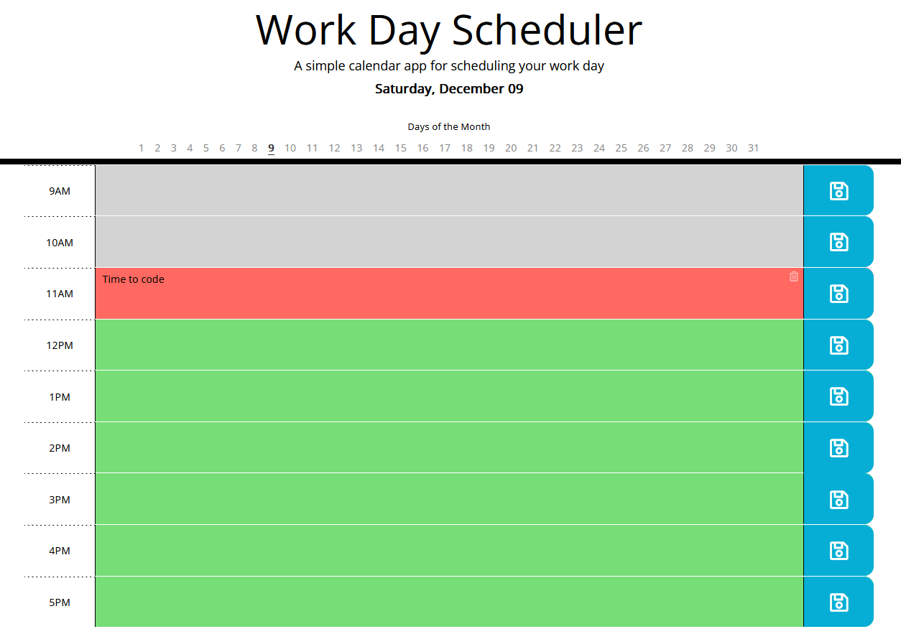

# Work Day Scheduler

## Overview

Work Day Scheduler is a simple yet effective calendar application designed to help users manage their daily tasks and appointments seamlessly. The application utilizes dynamic updates to HTML and CSS through jQuery, providing an intuitive and user-friendly interface.

## Screenshot

*A snapshot of the Work Day Scheduler interface with color-coded timeblocks and a clean, user-friendly design.*

## Features

- **Current Day Display:** The application displays the current day at the top of the calendar when opened.

- **Timeblock Organization:** Timeblocks for standard business hours are presented as the user scrolls down the planner.

- **Event Entry:** Users can enter events by clicking on a specific timeblock.

- **Content Clearing Capability:** Users have the ability to individually clear the content for each entry.

- **Days of the Month Tabs:** The app displays tabs for each day of the month, allowing users to switch between days and save tasks/appointments for different days.

- **Color-coded Timeblocks:** Each timeblock is color-coded to indicate whether it is in the past, present, or future, providing visual clarity.

- **Local Storage:** Events are saved to local storage when the save button within a timeblock is clicked, ensuring persistence between page refreshes.

- **Button Disablement:** When the user clicks the save button, all buttons are disabled temporarily to prevent multiple clicks.

- **Popup for Empty Entry:** If the user tries to save notes without entering any text, a popup will prompt them to fill the content before saving.

- **Popup for Successful Save:** After successfully saving an appointment, a popup notifies the user that the appointment has been saved.

## How to Use It

1. Clone the repository.
2. Open the `index.html` file in your preferred web browser.
3. Interact with the calendar interface to enter, save, and manage your daily tasks and appointments.
4. Alternatively, you can use the Work Day Scheduler directly simply navigate to the [GitHub Pages](https://martindocs-bootcamp.github.io/mtatarski-work-day-scheduler/).

## Future Enhancements

- **Month Navigation:** Allow users to switch between months, giving them the ability to view and save data for different months.

- **Bulk Data Management:** Provide users with the ability to remove data for a particular day, week.

## Credits

N/A (Open for contributions).

## License

Please refer to the [LICENSE](./LICENSE.md) file in this repository for details on how this project is licensed.
